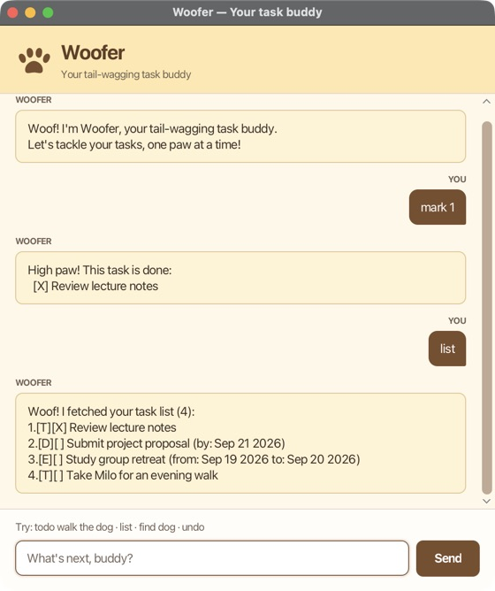

# Woofer User Guide

**Your tail-wagging task buddy.** Woofer is a desktop chatbot that helps you track to-dos, deadlines, and events through short typed commands. Add a task, sniff out a reminder, and celebrate getting things done with a high paw!



## Quick start

1. Install **Java 25** and confirm that `java -version` reports version 25.
2. Place `woofer.jar` in a folder where you have permission to save files.
3. Open a terminal in that folder and run:

   ```bash
   java -jar woofer.jar
   ```

4. In the Woofer window, type `todo walk the dog` and press **Enter** or click **Send**. Then try `list`.

If you are working from the source repository instead, run `./gradlew shadowJar` to create `build/libs/woofer.jar`, or `./gradlew run` to launch directly. On Windows, use `gradlew.bat` in place of `./gradlew`.

The screenshot shows example tasks; a new installation starts with an empty list. You can resize the window and scroll through earlier messages.

## Before you type

- Commands are **case-sensitive**: use `todo`, not `TODO`. Enter one command at a time.
- Replace words in `UPPER_CASE` below with your own values. Descriptions can contain spaces. Extra spaces and tabs are normalized to single spaces.
- Dates use **`yyyy-MM-dd`**, such as `2026-09-21`. Times are not supported.
- For deadlines and events, include each date marker exactly once, in the order shown, with spaces around it.
- Task descriptions cannot contain `|`. In deadlines and events, `/by`, `/from`, and `/to` are reserved date markers.
- Woofer holds up to **100 tasks**, including completed tasks. Identical tasks are allowed.

## Features

### Add a to-do: `todo`

Use a to-do for something without a date.

**Format:** `todo DESCRIPTION`

**Example:** `todo review lecture notes`

Woofer adds the task as not done, shows the new task, and reports how many tasks are in your list.

### Add a deadline: `deadline`

Use a deadline for something due on a particular day.

**Format:** `deadline DESCRIPTION /by DATE`

**Example:** `deadline submit project proposal /by 2026-09-21`

The new task appears as `[D][ ] submit project proposal (by: Sep 21 2026)`.

### Add an event: `event`

Use an event for an activity spanning multiple days. The end date must be **after** the start date; same-day events are not accepted.

**Format:** `event DESCRIPTION /from START_DATE /to END_DATE`

**Example:** `event study group retreat /from 2026-09-19 /to 2026-09-20`

Woofer adds the event and displays both dates.

### View all tasks: `list`

**Format and example:** `list`

Shows every task, including completed ones, in insertion order with a number starting at 1.

```text
Woof! I fetched your task list (3):
1.[T][ ] review lecture notes
2.[D][ ] submit project proposal (by: Sep 21 2026)
3.[E][ ] study group retreat (from: Sep 19 2026 to: Sep 20 2026)
```

`[T]`, `[D]`, and `[E]` mean to-do, deadline, and event. `[ ]` means not done; `[X]` means done.

### Find tasks: `find`

**Format:** `find SEARCH_TEXT`

**Example:** `find proposal`

Searches task descriptions for the supplied text, ignoring letter case. Partial matches work: `find lect` finds `review lecture notes`. Multiple words are matched as one phrase, not as separate keywords. Dates are not searched.

**Always run `list` before changing a task after a search.** Search results have their own numbering; `mark`, `unmark`, and `delete` use the numbers from the full task list, not the search results.

### Mark a task as done: `mark`

**Format:** `mark NUMBER`

**Example:** `mark 1`

Marks task 1 from `list` as done. Woofer replies:

```text
High paw! This task is done:
  [X] review lecture notes
```

The task stays in your list.

### Mark a task as not done: `unmark`

**Format:** `unmark NUMBER`

**Example:** `unmark 1`

Changes task 1 back to not done. Marking an already completed task, or unmarking an unfinished task, leaves its status unchanged.

### Delete a task: `delete`

**Format:** `delete NUMBER`

**Example:** `delete 2`

Immediately removes task 2 and reports the remaining count. Later task numbers shift down, so run `list` again before choosing another number. Deleted the wrong task? Use `undo` before making another change.

### Undo the latest change: `undo`

**Format and example:** `undo`

Reverses the latest successful add, delete, mark, or unmark command. For example, `delete 2` followed by `undo` restores the task at its original position with its previous completion status.

Only **one change** can be undone. There is no redo. Running `list`, `find`, or an invalid command does not replace the pending undo action. Repeated mark/unmark commands do count as the latest change, even if the status stays the same. Undo history is cleared when Woofer restarts.

### Finish your session: `bye`

**Format and example:** `bye`

Woofer says goodbye and disables command entry. Close the window to exit, then reopen the app when you need your buddy again.

## Saving your tasks

Woofer automatically saves after each successful add, delete, mark, unmark, or undo. There is no separate save command. Completed tasks remain saved; conversation messages and undo history do not.

Tasks are stored in **`data/woofer.txt` relative to the folder you launch Woofer from**. Always launch from the same folder to load the same tasks. A missing file is treated as an empty list; Woofer creates it and its parent folder when saving.

To back up or transfer tasks, close Woofer and copy `data/woofer.txt`. Keep a backup before editing that file manually.

## When something goes wrong

| Problem | What to do |
| --- | --- |
| Command format error | Follow the format in Woofer's red attention message. Your input stays in the box for correction, and rejected commands do not change your tasks. |
| Task number does not exist | Run `list` and choose a positive whole number from that list. |
| Date is rejected | Use a real date in `yyyy-MM-dd` format. For events, the end must be later than the start. |
| Task list is full | Delete an unneeded task before adding another. Marking it done does not free space. |
| Nothing to undo | Make a task change first. Only the latest change in the current session can be undone once. |
| Tasks seem to have disappeared | Check that you launched Woofer from the usual folder and that its `data/woofer.txt` is present. |
| Saved tasks cannot be loaded | Woofer starts empty and disables saving for that session to protect the original file. Back up the file, repair invalid records or access permissions, then restart. Tasks entered in that session are only in memory. |
| Tasks cannot be saved | Changes are only in memory. Check file/folder permissions and available disk space. Once resolved, make another task change to retry saving before closing. If saving was disabled at startup, repair the load problem and restart instead. |

## Command summary

| Action | Command |
| --- | --- |
| Add to-do | `todo DESCRIPTION` |
| Add deadline | `deadline DESCRIPTION /by DATE` |
| Add event | `event DESCRIPTION /from START_DATE /to END_DATE` |
| Show all tasks | `list` |
| Search descriptions | `find SEARCH_TEXT` |
| Mark done | `mark NUMBER` |
| Mark not done | `unmark NUMBER` |
| Delete task | `delete NUMBER` |
| Undo latest change | `undo` |
| End session | `bye` |
